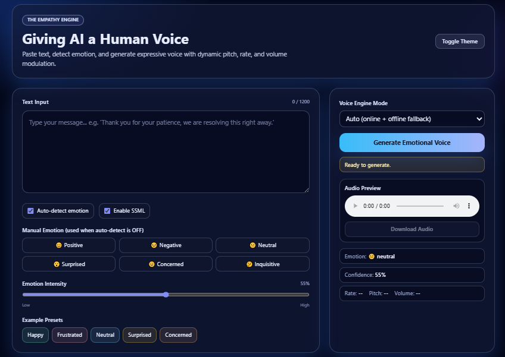

# The Empathy Engine

**Giving AI a Human Voice**

The Empathy Engine is a Python service that reads text, infers emotion, and synthesizes speech with **modulated rate, pitch, and volume** so delivery matches the mood of the message. It is built for demos, hackathons, and coursework where you need both a **working pipeline** and a **polished web interface**.

### Web UI preview



---

## What It Does

1. **Text in** — CLI prompt, REST API, or the browser UI.
2. **Emotion** — VADER sentiment plus light keyword/heuristic rules for six labels: `positive`, `negative`, `neutral`, `inquisitive`, `surprised`, `concerned`.
3. **Voice** — Maps emotion (and intensity) to TTS parameters; online synthesis uses **Microsoft Edge TTS** (neural voice); offline uses **pyttsx3** with automatic fallback when the network is unavailable.
4. **Audio out** — Playable **`.mp3`** (online) or **`.wav`** (offline).

---

## Features

| Area | Details |
|------|---------|
| **CLI** | `main.py` — `--text`, `--mode auto\|online\|offline`, `--output` |
| **REST API** | FastAPI — `POST /synthesize`, OpenAPI at `/docs` |
| **Web UI** | Tailwind (CDN) + vanilla JS — `static/index.html`, served at `/` |
| **Static assets** | `static/style.css` — waveform animation, glass-style helpers |
| **SSML (subset)** | `break`, `emphasis`, `prosody` → merged into prosody before TTS |
| **Manual override** | API/UI can disable auto-detect and pick emotion + intensity slider |
| **Resilience** | `auto` mode tries online TTS, then falls back to offline |

---

## Project Structure

```
empathy_engine/
├── main.py              # Core: emotion, SSML parse, voice profiles, TTS routing, CLI
├── api.py               # FastAPI app: /, /synthesize, static + audio mounts
├── requirements.txt     # Python dependencies
├── README.md            # This file
├── image.png            # Screenshot for README / demos
├── static/
│   ├── index.html       # Full single-page UI (Tailwind + JS)
│   └── style.css        # Extra styles (wave bars, chips)
└── generated_audio/     # Created at runtime; files served under /audio/
```

---

## Requirements

- **Python 3.10+** (3.13 works on current stacks)
- **Internet** for online TTS (`edge-tts`); optional for offline-only demos
- **Windows/macOS/Linux** — offline path depends on OS speech engines for `pyttsx3`

---

## Setup

From the project root:

```bash
pip install -r requirements.txt
```

Dependencies:

- `vaderSentiment` — sentiment / emotion cues  
- `pyttsx3` — offline TTS  
- `edge-tts` — online neural TTS  
- `fastapi`, `uvicorn` — API server  

---

## How to Run

### 1) Web demo (recommended for judges)

```bash
python -m uvicorn api:app --reload
```

Open **http://127.0.0.1:8000/**

The UI includes:

- Large text input with character count  
- **Auto-detect emotion** toggle and **manual emotion chips**  
- **Intensity** slider (10–100%)  
- **Generate Emotional Voice** with loading state  
- Result: emotion, confidence-style readout, rate / pitch / volume summary  
- HTML5 audio + decorative waveform + **download** link  
- Presets: Happy, Frustrated, Neutral, Surprised, Concerned  
- Optional **dark/light** toggle (Tailwind `dark` class)  

**Windows note:** If `uvicorn` is not found, always use `python -m uvicorn` so the module runs without adding `Scripts` to `PATH`.

### 2) Interactive API docs

**http://127.0.0.1:8000/docs** — try `POST /synthesize` with a JSON body.

### 3) CLI

```bash
python main.py --mode auto --text "Great news! We closed the deal." --output output.mp3
python main.py --mode online --text "Hello!" --output online.mp3
python main.py --mode offline --text "I hear you." --output offline.wav
```

Omit `--text` to type input when prompted.

---

## API Reference

### `POST /synthesize`

**Content-Type:** `application/json`

| Field | Type | Default | Description |
|-------|------|---------|-------------|
| `text` | string | required | Input text (max length enforced in UI only; API accepts reasonable strings) |
| `mode` | string | `auto` | `auto`, `online`, or `offline` |
| `use_ssml` | boolean | `true` | Parse SSML subset when tags present |
| `auto_detect_emotion` | boolean | `true` | If `false`, use `emotion` below |
| `emotion` | string | `neutral` | One of: `positive`, `negative`, `neutral`, `inquisitive`, `surprised`, `concerned` |
| `intensity` | int | `55` | 10–100; scales modulation strength (baseline reference 55) |

**Example (auto emotion):**

```json
{
  "text": "Thanks for your patience while we fix this.",
  "mode": "auto",
  "use_ssml": true,
  "auto_detect_emotion": true,
  "intensity": 70
}
```

**Example (manual emotion + high intensity):**

```json
{
  "text": "We appreciate your business!",
  "mode": "auto",
  "auto_detect_emotion": false,
  "emotion": "positive",
  "intensity": 95
}
```

**Response (selected fields):**

- `emotion`, `intensity`, `provider` (`online-edge-tts` or `offline-pyttsx3`)  
- `audio_url` — path under `/audio/...`  
- `processed_text` — after SSML stripping/normalization  
- `rate_wpm`, `volume`, `pitch_hz` — applied profile (offline pitch is profile metadata; online applies rate/volume/pitch via Edge TTS)

### Static files

- **GET /** — serves `static/index.html`  
- **GET /static/...** — `style.css` and future assets  
- **GET /audio/...** — generated files in `generated_audio/`

---

## Emotion → Voice Mapping (Design)

Logic lives in **`build_voice_profile(emotion, intensity)`** in `main.py`.

- **Positive** — faster rate, slightly louder, upward pitch bias  
- **Negative** — slower rate, softer/controlled volume, downward pitch bias  
- **Neutral** — baseline conversational settings  
- **Inquisitive** — slightly quicker, curious lift in pitch  
- **Surprised** — strongest upward energy (rate + pitch)  
- **Concerned** — slower, calmer, reassuring softness  

**Intensity** combines VADER magnitude with punctuation and ALL-CAPS emphasis, then is clamped to `[0, 1]`. The API **intensity slider** scales that value (relative to a 55% baseline) when you want stronger or subtler modulation.

**Manual emotion:** When `auto_detect_emotion` is false, the chosen `emotion` is used and intensity still comes from the slider × detected baseline where applicable.

---

## SSML Subset

When `use_ssml` is true and the input contains tags, a small subset is interpreted:

- `<break time="500ms"/>` — approximated as pauses in plain text  
- `<emphasis level="strong|moderate|reduced">...</emphasis>` — adjusts deltas and punctuation  
- `<prosody rate="+10%" pitch="+3Hz" volume="+5%">...</prosody>` — adds to rate/pitch/volume deltas  

Wrapping root `<speak>` is stripped. Unsupported tags are removed after processing.

---

## Connecting Another Backend (e.g. Flask)

This repo uses **FastAPI**; the same contract works on **Flask** with minimal changes:

1. Expose `POST /synthesize` that accepts the same JSON and calls the same logic as `synthesize_text()` from `main.py`.  
2. Save audio to a folder and return JSON including a URL path the browser can open (e.g. `/audio/<filename>`).  
3. Serve `static/index.html` at `/` and mount the audio directory as static files.  
4. In `static/index.html`, if the frontend is hosted on another origin, set `fetch` to your Flask base URL or configure CORS on Flask.

---

## Challenge Checklist (Typical Rubric)

- [x] Text input (CLI + API + web)  
- [x] ≥3 emotion categories (six implemented)  
- [x] ≥2 vocal parameters (rate, volume, pitch profile)  
- [x] Clear emotion → parameter mapping in code  
- [x] Playable audio file output  
- [x] Bonus: granular emotions, intensity scaling, web UI, SSML subset, online/offline fallback  

---

## Troubleshooting

| Issue | What to try |
|-------|-------------|
| Online TTS fails | Check internet; install `edge-tts`; use `mode: offline` |
| `uvicorn` not found (Windows) | `python -m uvicorn api:app --reload` |
| Offline voice silent / errors | Confirm OS TTS voices; use `.wav` output |
| CORS if splitting frontend | Enable CORS on the API or serve UI from same host/port |

---

## License

Use and modify for your course or hackathon submission as permitted by your institution. Add a `LICENSE` file if you publish publicly.

---

## Acknowledgements

- **VADER** (sentiment)  
- **edge-tts** (Microsoft Edge neural voices)  
- **pyttsx3** (offline TTS)  
- **FastAPI**, **Tailwind CSS** (UI via CDN)
